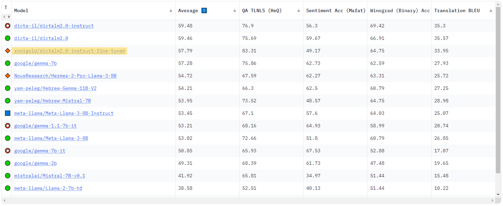
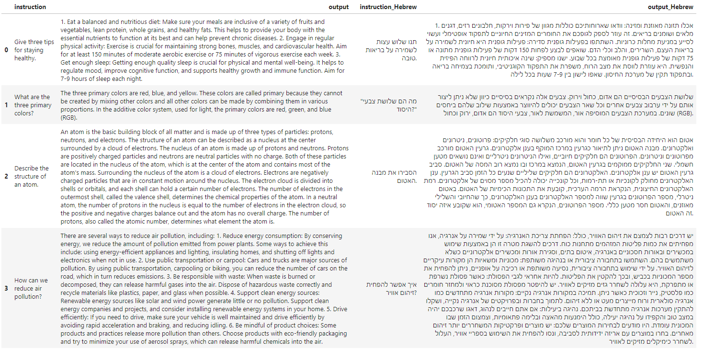

# DictaLM-2.0-Instruct Fine-Tuning Project

This project aims to enhance the performance of the DictaLM-2.0-Instruct model by fine-tuning it on a bilingual (English-Hebrew) dataset. The project utilizes a unique dataset derived from the alpaca-gpt4 English data, which has been translated into Hebrew to create a rich, bilingual resource for training.

## Project Overview

The DictaLM-2.0-Instruct, a model provided by Hugging Face and tailored for instruction-based tasks, is fine-tuned here to improve its responsiveness and accuracy in two specific tasks:
1. **Question-Answering in Hebrew:** Direct question to answer mappings in Hebrew.
2. **Bilingual Translation Tasks:** Translation of questions and answers between English and Hebrew.

To prevent catastrophic forgetting, particularly in the model's ability to handle English, 10% of the training data is retained in English.

## Fine-Tuning Methodology

The model is fine-tuned using the LoRA (Low-Rank Adaptation) technique, which allows for efficient adaptation of large language models with minimal updates to the model's parameters. This method is particularly suited for adapting a model to new languages and tasks without extensive retraining.

## Dataset

The dataset, derived from the [alpaca-gpt4-dataset](https://huggingface.co/datasets/vicgalle/alpaca-gpt4), includes:
- Translations of the original English content into Hebrew.
- Retention of 10% original English questions to maintain language versatility.
- The dataset is split into training, validation, and test sets to ensure thorough evaluation.

## Data Creation

To generate the bilingual dataset, we utilized the DictaLM-2.0-Instruct model's translation capabilities. The entire alpaca-gpt4 database was processed through the model with prompts requesting translations into Hebrew. This approach ensures that the dataset reflects realistic and contextually appropriate translations.

### Repository Content

This repository includes:
- **Data Creation Notebook:** Detailed Jupyter notebooks outlining the process of translating the alpaca-gpt4 database into Hebrew.
- **Dataset Files:** Both the original and translated datasets are provided for transparency and reproducibility.
- **Training Notebook:** A Jupyter notebook detailing the fine-tuning process using the LoRA technique on the DictaLM-2.0-Instruct model.

The included materials aim to provide a comprehensive overview of the project's methodology and enable others to replicate or build upon this work.

## Usage

[Include instructions similar to previous suggestions]

## Contributing

[Include contribution guidelines similar to previous suggestions]

## Citation

[Include citation details similar to previous suggestions]

## License

This project is licensed under the Apache License 2.0 - see the [LICENSE](LICENSE) file for details.

## Acknowledgements

This project utilizes resources and tools from Hugging Face and is based on data from the alpaca-gpt4 project.
